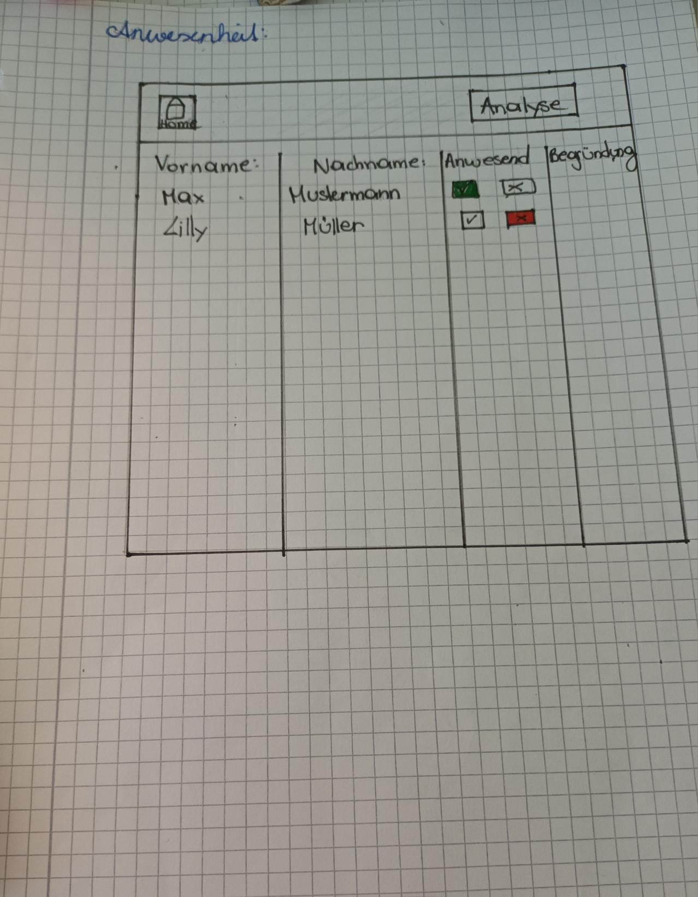

# **PrecensLog Sport**

## Projektgruppe: Aleksandra Vidovic & Alina Bischof
## Klasse: 2AHIF
## Jahr: 2025

## Betreuer: Lukas Diem, David Bechtold                                                                                    
## Kurzbeschreibung: Desktop Anwendung für Sportvereine zur Unterstützung der Anwesenheitskontrolle und Trainingsvorbereitung.

### 1	Inhaltsverzeichnis
    2   Projektzeitplan
    3	Lastenheft (Kurzbeschreibung, Funktionsumfang, Skizzen)
        3.1. Kurzbeschreibung 
        3.2. Skizzen
        3.3. Funktionsumfang
    4	Pflichtenheft
        4.1	Interner Programmaufbau (Programmlogik)
        4.2	Umsetzungsdetails
        4.3	Ergebnisse, Interpretation (Tests)
    5	Anleitung
        5.1	Installationsanleitung
        5.2	Bedienungsanleitung
    6	Bekannte Bugs, Probleme
    7	Erweiterungsmöglichkeiten

### 2	Projektzeitplan
|    Datum    |   Aufgabe  | Bearbeiter | Status in % |
| ----------- | ---------- | ---------- | ---------- |
|  14.05.2025 | Personen-Klasse | Aleksandra Vidovic | 50% |
|  14.05.2025 | Personen-Collection-Klasse | Aleksandra Vidovic | 50% |
|  14.05.2025 | Trainingsgruppe-Collection-Klasse | Aleksandra Vidovic | 50% |
|  14.05.2025 | Startseite GUI | Aleksandra Vidovic | 15% |
|  14.05.2025 | UserControl GUI | Aleksandra Vidovic | 100% |
|  14.05.2025 | Trainingsgruppe-Klasse | Alina Bischof| 50% |
|  14.05.2025 | Library mit Klassen erstellt | Alina Bischof| 100% |
|  14.05.2025 | Analysepage & Anwesenheitspage erstellt | Alina Bischof| 10% |
|  16.05.2025 | Trainingsgruppe erstellen Button Click_Event erstellt | Aleksandra Vidovic | 50% |
|  16.05.2025 | TrainingsgruppenErstellen Window aufgebaut | Aleksandra Vidovic | 60% |
|  16.05.2025 | Personen Klasse Methode: Serialize und Deserialize | Alina Bischof | 80% |
|  16.05.2025 | PersonenCollection Klasse-Methode: Load from CSV | Alina Bischof | 90% |
|  17.05.2025 | Person-Klasse und PersonenCollection alle Methoden implementiert mit Fehlerbehandlung bei Laden und Speichern einer Datei | Alina Bischof | 100% |
|  21.05.2025 | Trainingsgruppe erstellen (GUI) aufgebaut| Aleksandra Vidovic und Alina Bischof | 100% |
|  21.05.2025 | AnwesenheitsPage GUI aufgebaut | Alina Bischof | 100% |
|  21.05.2025 | OK_Button programmiert | Aleksandra Vidovic| 100% |
|  21.05.2025 | Abbrechen_Button programmiert | Aleksandra Vidovic | 100% |
|  21.05.2025 | AnwesenheitsPage Tabelle Binding | Alina Bischof | 10%  |
|  26.05.2025 | die unten beschriebenen Probleme gelöst und ausgebessert | Alina Bischof | 10% |
|  28.05.2025 | Beim OK Button wurde Daten hinzugefügt | Aleksandra Vidovic | 100% |
|  28.05.2025 | AbwesendBegruendung Window erstellt und formartiert | Alina Bischof | 80% |
|  28.05.2025 | AnwesenheitsPage Anwesend/Abwesend Button: Hintergrundfarbe und dass nur einer angeklickt werden kann | Alina Bischof | 100% |
|  03.06.2025 | Begründung kann eingegeben werden aber wird noch nicht zur richtigen Person gespeichert. | Alina Bischof | 80% |
|  03.06.2025 | AbAnwesenheitKlasse erstellt. Deshalb gibt es noch bugs.| Alina Bischof | 70% |
|  04.06.2025 | Home-Button und Analyse-Buttons erstellt | Aleksandra Vidovic | 100% |
|  04.06.2025 | Bugs gefixed. AbAnwesenheit Klasse funktioniert jetzt.| Alina Bischof | 100% |
|  04.06.2025 | Anwesenheitspage Begründung funktioniert. | Alina Bischof | 100% |
|  04.06.2025 | MainWindow mit Trainingsgruppen anzeigen in arbeit. | Alina Bischof | 20% |
|  05.06.2025 | Im MainWindow Trainingsgruppe erstellen und mit DatePicker anzeigen lassen weiterprogrammiert. | Alina Bischof | 70% |
|  06.06.2025 | Home Button für die Analyse-Page erstellt| Aleksandra Vidovic | 100% |
|  06.06.2025 | Home Button wurde gecodet | Aleksandra Vidovic | 100 % |
|  06.06.2025 | Personenhinzufuegen Fenster erstellt | Aleksandra Vidovic | 50% |
|  06.06.2025 | + Button für Personen hinzufügen erstellt | Aleksandra Vidovic | 100% |
|  06.06.2025 | Mit der Checkbox angehakte Personen werden der Trainingsgruppe hinzugefügt. | Alina Bischof | 100% |
|  07.06.2025 | Personhinzufuegen GUI und Code behind wo alles Eingegebene gespeichert wird. | Alina Bischof | 100% |
|  07.06.2025 | Neu erstellte Person wird in Listview von TrainingsgruppeErstellen angezeigt. | Alina Bischof | 100% |
|  07.06.2025 | Alle Personen die jemals hinzugefügt wurden werden in der ListView angezeigt. | Alina Bischof | 100% |
|  07.06.2025 | Alle Trainingsgruppen werden in Json Format gespeichert und können geladen werden. | Alina Bischof | 100% |
|  07.06.2025 | Problem mit DatePicker in MainWindow und Trainingsgruppen werden nicht angezeigt gelöst. | Alina Bischof | 100% |
|  07.06.2025 | Eine StartPage erstellt und den Code vom MainWindow.xaml in die StartPage kopiert, damit im MainWindow nur der Frame steht. | Alina Bischof | 100% |
|  07.06.2025 | Mit doppelklick auf ein TrainingsgruppeUserControl auf der StartPage öffnet sich die AnwesenheitsPage. | Alina Bischof | 100% |
|  08.06.2025 | Problem mit gespeichertePersonen.txt Datei eingetragen und gelöst. | Alina Bischof | 100% |
|  08.06.2025 | AnwesenheitsPage und AnalysePage Buttons für "nächste-" und "vorherige Seite" eingebaut. | Alina Bischof | 100% |
|  08.06.2025 | AnalysePage übernimmt Personen der ausgewählten Trainingsgruppe und eine ProgressBar zeigt die Anzahl der Anwesen- und Abwesenheiten an. | Alina Bischof | 100% |
|  10.06.2025 | Textbox Fehlerbehandlung bei Begründungsfenster | Aleksandra Vidovic | 100% |
|  10.06.2025 | Startdatum und Enddatum Fehlerbehandlung bei TrainingsgruppeErstellen.XAML.cs | Aleksandra Vidovic | 100% | 
|  10.06.2025 | Wochentage Fehlerbehandlung bei TrainingsgruppeErstellen.XAML.cs | Aleksandra Vidovic | 100% |
|  10.06.2025 | Bug bei new AbAnwesenheit gelöst | Aleksandra Vidovic | 100 % | 
|  10.06.2025 | Bug bei Deserialize bei Person.cs gelöst | Aleksandra Vidovic | 100 % |
|  10.06.2025 | Uhrzeit wird bei AnwesenheitsPage nicht mehr angezeigt. | Alina Bischof | 100% |
|  10.06.2025 | Das Datum des DatePickers auf der Startseite wird der AnwesenheitsPage mitgegeben für das Speichern der Ab/Anwesenheit. | Alina Bischof | 100% |
|  10.06.2025 | versucht dass die Buttons farbig bleiben auch wenn man zurück zur Startseite und wieder zur AnwesenheitsPage geht. | Alina Bischof | 50% |
|  11.06.2025 | GUI ansprechender gestaltet | Alina Bischof | 40% |
|  13.06.2025 | GUI ansprechender gestaltet | Alina Bischof | 80% |
|  14.06.2025 | GUI ansprechender gestaltet | Alina Bischof | 100% |
|  14.06.2025 | Bug bei Abwesend Begründung richtig speichern gelöst. | Alina Bischof | 100% |
|  14.06.2025 | Dokumentation vervollständigt | Alina Bischof | 90% |
|  15.06.2025 | Serilog NuGet Packages installiert | Alina Bischof | 100% |
|  15.06.2025 | Logging eingebaut | Alina Bischof | 100% |
|  15.06.2025 | Dokumentation vervollständigt | Alina Bischof | 95% |
|  15.06.2025 | Logging in die Unterordner data/log/ geändert| Alina Bischof | 100% |
|  15.06.2025 | GIT-Repo mit Ordner strukturiert | Alina Bischof | 100% |
|  16.06.2025 | AnwesenheitsPage Bug mit Begründung gelöst. | Alina Bischof | 100% |
|  16.06.2025 | Gelöst dass keine Trainingsgruppen mit null gespeichert werden. | Alina Bischof | 100% |
|  16.06.2025 | Dokumentation vervollständigt | Alina Bischof | 100% |

### 3	Lastenheft (Kurzbeschreibung, Funktionsumfang, Skizzen)
#### 3.1. Kurzbeschreibung 
Desktop Anwendung für Sportvereine zur Unterstützung der Anwesenheitskontrolle und Trainingsvorbereitung. Trainingsgruppen können erstellt, an benutzerdefinierten Tagen gespeichert und angezeigt werden. Die Anwesenheit der Personen einer Trainingsgruppe wird übersichtlich organisiert.

#### 3.2. Skizzen

#### 3.3. Funktionsumfang
Auf der Startseite kann ein gewünschtes Datum ausgewählt oder eine neue Trainingsgruppe erstellt werden. Beim Erstellen einer neuer Trainingsgruppe müssen der Titel, Start- und Enddatum, gewünschten Trainingstage und die dazugehörigen Personen angeben. Es gibt auch die Möglichkeit, eine neue Person der Anwendung hinzuzufügen. Wird auf der Startseite ein Datum ausgewählt, erscheinen alle Trainingsgruppen, die an diesem Tag eingetragen wurden. Mit einem Doppelklick auf die Trainingsgruppe gelangt man zur Anwesenheit. Hier kann die Anwesenheit der Mitglieder durch zwei Button festgehalten werden. Wenn eine Person als Abwesend eingetragen wird, öffnet sich ein weiteres Fenster zur Angabe wieso die Person abwesend ist. Mit einem Button kann man auch zur Analyse-Seite gelangen. Dort sieht man grafisch wieviel mal eine Person an- oder abwesend war.

Must haves: 100% erfüllt
* Kalenderansicht → Datumauswahl → Trainingsgruppen 
* neue Trainingsgruppen erstellen
* neue Personen anlegen
* Personen bleiben gespeichert
* Anwesenheitsliste pro Trainingsgruppe
* Buttons für “Anwesend” oder “Abwesend”
* “Abwesend” →  Unterfenster → Begründung eingeben 
* “Zurück” Button
* Analyse-Page

Nice to haves: "Suchleiste für Datum" eigebaut
* Suchleiste für Datum oder Trainingsgruppen
* Notizfeld pro Trainingseinheit
* Zufallsgenerator für Aufwärmübungen
* Namen der Personen alphabetisch sortieren
* Zusätzliche Informationen eingeben z.B.: Telefonnummer, etc.
* Timer / Stoppuhr
* Hintergrundfarbe der Trainingsgruppe ändern

 
### 4	Pflichtenheft
#### 4.1	Interner Programmaufbau (Programmlogik)
Es gibt eine Library namens "PrecensLog_SportLib" für alle Klassen.
Unsere Klassen:
* AbAnwesenheit: speichert die Ab- oder Anweseneheit als Objekt mit Status, Begründung und Datum
* AnalyseEintrag: die Anzeige in der GUI für die Analyse
* Person: erzeugt Personenobjekte mit Vorname, Nachname, Geburtsdatum und Anwesenheit
* PersonenCollection: speichert die Personenobjekte in eine Liste, speichert und ladet diese Liste
* Trainingsgruppe: erzeugt Trainingsgruppenobjekte mit Titel, Startdatum, Enddatum, ausgewählte Wochentage und dazugehörige Personen
* TrainingsgruppeCollection: speichert die Trainingsgruppenobjekte in eine Liste, speichert und ladet diese Liste

Zu den anderen Klassen gibt es keine Skizzen da diese nicht von anfang an geplant waren.

#### 4.2	Umsetzungsdetails
Detaillierte Beschreibung der Umsetzung mit möglichen Fehlern und Lösungen
|    Datum    |   Fehler   | Lösung | Bearbeiter |
| ----------- | ---------- | ---------- | ---------- |
|  26.05.2025 |  kein Zugriff auf Properties | Properties öffentlich machen | Alina Bischof |
|  26.05.2025 |  Property einmal Geburtsdatum und einmal Geburtstag benannt | alles auf Geburtsdatum geändert | Alina Bischof |
|  04.06.2025 |  Home-Button (Bild) konnte nicht richtig hinzugefügt werden | Mit dem <Image Source="Bilder/name des bildes"> verändert und damit das Foto in dem Home-Button drinnen ist, tut man das zwischen <Button><Image Source.../></Button> hinzufügen. | Aleksandra Vidovic |  
|  04.06.2025 |  Es öffnen sich die falschen Fenster, wenn man auf die button drückt, obwohl die richtigen fenster angegeben worden sind | Ich habe versucht, ein Fenster zu öffnen, anstatt eine Page. Mit ShowDialog öffnet man ein Fenster und keine Page. | Aleksandra Vidovic |
|  04.06.2025 |  Wenn ich auf dem Button "Trainingsgruppe erstellen" drücke, dann öffnet sich das Fenster nicht wo der Titel etc. eingegeben wird.| Fehlerbehandlung programmieren, da DataSplit[3] kein gültiges JSON ist. | Aleksandra Vidovic |
|  07.06.2025 |  Wenn mit dem DatePicker im MainWindow ein Datum ausgewählt wird, wo eigentlich eine Trainingsgruppe gespeichert ist, ist keine Trainingsgruppe vorhanden. | Mit debuggen habe ich herausgefunden, dass eine leere Wochentag-Liste aus der gespeicherten Datei geladen wird, weil System.Text.Json ignoriert Felder standardmäßig. Und die Wochentag-Liste war ein öffentliches Feld und kein Property. | Alina Bischof |
|  07.06.2024 |  Sobald eine neue Trainingsgruppe erstellt wird, werden in der Json-Datei die Personen aus den anderen, schon gespeicherten Trainingsgruppen gelöscht. | Wir hatten zwei unterschiedliche Serializer/Deserializer eingebaut. Einmal den von Newtonsoft und einmal den von .NET. Das hat zu Problemen geführt. Jetzt wird immer Deserialize von Newtonsoft verwendet.| Alina Bischof |
|  08.06.2024 |  Wenn auf den "+" Button geklickt wird um eine Person hinzuzufügen, wird in der .txt-Datei eine leere Person hinzugefügt. | Nicht vor, sonder in dem if wo man prüft ob das Fenster mit dem Button "Okay" oder "Abbrechen" beendet worden ist. | Alina Bischof |
|  14.06.2025 |  Wird im BegründungWindow auf "Abbrechen" geklickt, wird das Eingegebene trotzdem gespeichert. | Man hat vergessen beim Abbrechen-Button Click DialogResult auf False zu setzten | Alina Bischof |
|  16.06.2025 |  Die Farbe der Buttons auf der AnwesenheitsPage werden nicht mehr richtig angezeigt und die Begründung wird nicht richtig gespeichert. | Bei deiner AbAnwesenheit Klasse, war im Konstruktor kein Datum zu gesetzt. Bei der TextBox Begründung noch ein Loaded-Event inzugefügt. | Alina Bischof |
|  16.06.2025 |  Wenn beim TrainingsgruppenErstellenWindow auf "Abbrechen" geklickt wird, wird in der JSON-Datei eine Trainingsgruppe mit allen Properties null gespeichert.| Die Zeile Code zum die neu erstellte Trainingsgruppe der Collection hinzuzufügen in das if hineingetan in dem geprüft wird ob das ShowDialogResult true ist. Weil es soll ja nur eine Trainingsgruppe erstellt werden, wenn auf "Okay" geklickt wurde. | Alina Bischof | 

#### 4.3	Ergebnisse, Interpretation (Tests)
Schwachstellen: Fehlerhafte eingaben
 

### 5	Anleitung
#### 5.1	Installationsanleitung

* SerilogNewtonsoft.Json 
    Version: 13.0.3
* Serilog 
    Version: 4.3.0
* Serilog.Sinks.Console
    Version: 6.0.0
* Serilog.Sinks.File
    Version: 7.0.0

#### 5.2	Bedienungsanleitung
Auf der Startseite kann ein gewünschtes Datum ausgewählt oder eine neue Trainingsgruppe erstellt werden. Beim erstellen einer neuer Trainingsgruppe muss der Titel, Start- und Enddatum, gewünschten Trainingstage und die dazugehörigen Personen angeben. Es gibt auch die Möglichkeit, eine neue Person der Anwendung hinzuzufügen. Wird auf der Startseite ein Datum ausgewählt, erscheinen alle Trainingsgruppen die an diesem Tag eingetragen wurden. Mit einem Doppelklick auf die Trainingsgruppe gelangt man zur Anwesenheit. Hier kann die Anwesenheit der Mitglieder durch zwei Button festgehalten werden. Wenn eine Person als Abwesend eingetragen wird, öffnet sich ein weiteres Fenster zur Angabe wieso die Person abwesend ist. Mit einem Button kann man auch zur Analyse-Seite gelangen. Dort sieht man grafisch wieviel mal eine Person an- oder abwesend war.

### 6	Bekannte Bugs, Probleme
An einigen Stellen fehlen Fehlerbehandlungen. Diese wurden aus Zeitgründen nicht implementiert.

 
### 7	Erweiterungsmöglichkeiten
Wenn wir mehr Zeit gehabt hätten, hätten wir auf jeden Fall alle Nice-to-Haves umgesetzt.
